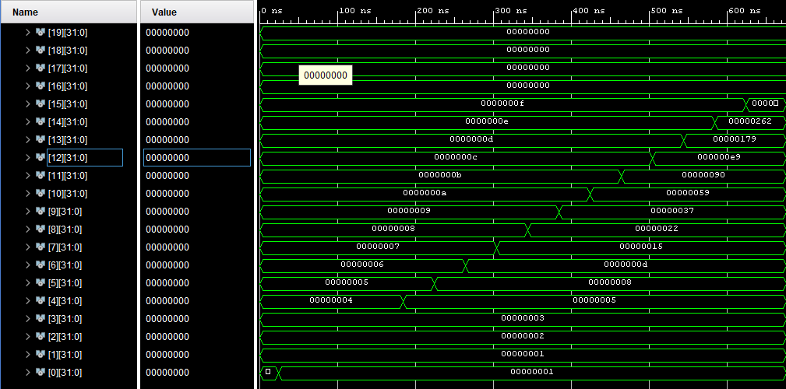

# CS 401 Digital Design and Computer Architecture Final Project

This was the final project for CS-401 Computer Architecture. The microprocessor was built using VHDL in Xilinx Vivado. My group decided to build something akin to a GPU that could do many simple calculations simultaneously.  

This project consisted of multiple aspects. The main part is the microprocessor itself. There is also a custom assembly language designed for interacting with the unique way the processor works. On top of that there is a compiler for the assembly language for compiling the assembly code into machine code.

The project was split up into different sections and each one has its own sub-folder.

The first section, FP1, contains the C++ code for the compiler. FP2 contains the initial VHDL code for just the ALU as well as a testbench used to test the functionality of the ALU. FP3 contains the bulk of the project, the entire microprocessor and the scrips for building it using Vivado. FP4 contains Vivado screenshots showing the processor working as expected.

## ALU

Table of the registers and their purposes

| Name     | Number   | Use  |Location (Global vs Local)|
|:--------:|:--------:|:----:|:------------------------:|
|:0        |0         |Stores zero. Read only.|   Global|
|:? |31|Checked against on branch functions|Global
|[A]-[G]   |1-8       |Stores arrays of 16 32bit values| Local|
|:a-:u |9-30|Stores standard 32bit values| Global|

<br>

Table of ALU functions and their associated op codes and flag values

| Function |       Inputs        | OpCode  |aluop |memWrite|globalStore|regWrite|loadFlag|immFlag|globalB|jump|brchZ|brchN|
|:--------:|:-------------------:|:-------:|:----:|:------:|:---------:|:------:|:------:|:-----:|:-:|:-:|:-:|:-:
| add      | Local, Local        | 10 0000 | 0000 |   0    |    0      |    1   | 0      |0      |0  | 0 | 0 | 0
| not      | Local               | 10 0001 | 0100 |   0    |    0      |    1   | 0      |0      |x  | 0 | 0 | 0
| and      | Local, Local        | 10 0010 | 0101 |   0    |    0      |    1   | 0      |0      |0  | 0 | 0 | 0
| sub      | Local, Local        | 10 0011 | 1000 |   0    |    0      |    1   | 0      |0      |0  | 0 | 0 | 0
| shl      | Local, Global       | 10 0100 | 0010 |   0    |    0      |    1   | 0      |0      |1  | 0 | 0 | 0
| shr      | Local, Global       | 10 0101 | 0011 |   0    |    0      |    1   | 0      |0      |1  | 0 | 0 | 0
| and      | Local, Global       | 10 0110 | 0101 |   0    |    0      |    1   | 0      |0      |1  | 0 | 0 | 0
| add      | Local, Global       | 10 0111 | 0000 |   0    |    0      |    1   | 0      |0      |1  | 0 | 0 | 0
| sub      | Local, Global       | 10 1000 | 1000 |   0    |    0      |    1   | 0      |0      |1  | 0 | 0 | 0
| not      | Global              | 10 1001 | 0100 |   0    |    1      |    1   | 0      |0      |x  | 0 | 0 | 0
| add      | Global, Global      | 10 1010 | 0000 |   0    |    1      |    1   | 0      |0      |x  | 0 | 0 | 0
| sub      | Global, Global      | 10 1011 | 1000 |   0    |    1      |    1   | 0      |0      |x  | 0 | 0 | 0
| and      | Global, Global      | 10 1100 | 0101 |   0    |    1      |    1   | 0      |0      |x  | 0 | 0 | 0
| add      | Global, Imm         | 11 0000 | 0000 |   0    |    1      |    1   | 0      |1      |x  | 0 | 0 | 0
| sub      | Global, Imm         | 11 0001 | 1000 |   0    |    1      |    1   | 0      |1      |x  | 0 | 0 | 0
| shl      | Global, Imm         | 11 0010 | 0010 |   0    |    1      |    1   | 0      |1      |x  | 0 | 0 | 0
| shr      | Global, Imm         | 11 0011 | 0011 |   0    |    1      |    1   | 0      |1      |x  | 0 | 0 | 0
| and      | Global, Imm         | 11 0100 | 0101 |   0    |    0      |    1   | 0      |1      |x  | 0 | 0 | 0
| sa       | Local, Imm Addr     | 01 0000 | xxxx |   1    |    0      |    0   | 0      |1      |x  | 0 | 0 | 0
| la       | Imm Addr            | 01 0001 | xxxx |   0    |    0      |    1   | 1      |1      |x  | 0 | 0 | 0
| sw       | Global, Imm Addr    | 01 0010 | xxxx |   1    |    1      |    0   | 0      |1      |x  | 0 | 0 | 0
| sa       | Local, Global Addr  | 00 0000 | xxxx |   1    |    0      |    0   | 0      |0      |x  | 0 | 0 | 0
| la       | Global Addr         | 00 0001 | xxxx |   0    |    0      |    1   | 1      |0      |x  | 0 | 0 | 0
| sw       | Global, Global Addr | 00 0010 | xxxx |   1    |    1      |    0   | 0      |0      |x  | 0 | 0 | 0
| lw       | Global Addr         | 00 0011 | xxxx |   0    |    1      |    1   | 1      |0      |x  | 0 | 0 | 0
| lw       | Imm Addr            | 01 0011 | xxxx |   0    |    1      |    1   | 1      |1      |x  | 0 | 0 | 0
| bz       | Imm Addr            | 01 0100 | xxxx |   0    |    0      |    0   | x      |x      |x  | 0 | 1 | 0 
| bn       | Imm Addr            | 01 0101 | xxxx |   0    |    0      |    0   | x      |x      |x  | 0 | 0 | 1
| j        | Immediate address   | 01 0110 | xxxx |   1    |    0      |    0   | x      |x      |x  | 1 | 0 | 0

<br>

## Microprocessor

Main Schematic for the microprocessor


Generated hardware of the microprocessor showing all 16 ALU's in parallel


## Running processor

Simple fibonacci program in the custom assembly language to show off the microprocessor

```
FIB 0,1,2,3,4,5,6,7,8,9,10,11,12,13,14,15, #array initialized to dummy values

.begin

:d <= :0 add :0     # :d is our counter register
:a <= :0 add 0      # start fib sequence with 0 and 1
:b <= :0 add 1

FIBBEGIN
:e <= :0 add FIB
:e <= :e add :d     # :e is now the :dth location in FIB
:b sw :e            # store :b at location :e in FIB

:c <= :a add :b     # :c = :a + :b
:a <= :0 add :b     # :a = :b 
:b <= :0 add :c     # :b = :c
:d <= :d add 1      # :d + 1
:? <= :d sub 16     # :d -16
bz <= END  
j <= FIBBEGIN       # jump back to beginning of function
                    #FIB will now contain the first 16 iterations of the fibonacci sequence
END

[A] la FIB          # array A contains all values in FIB
:a <= :0 add 2
:b <= :0 add 1
[B] <= [A] shl :a   # multiply by 4 and store in array B
[B] <= [B] add [A]  # multiply by 1 more (total 5)
[A] <= [B] shl :b    # multiply by 2 (total 10)

[A] sa FIB          #stores values in A back in FIB
```

Vivado screenshot showing initial array values (left) and the calculated Fibonacci numbers (right)



Vivado screenshot showing the Fibonacci array being multiplied by 10 simultaneously through the parallel ALUs


More information is contained within the readme files in each sub-folder